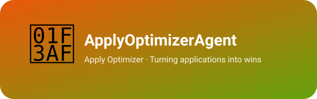

  

# ApplyOptimizerAgent

> 🎯 **Hopkins** — the application-funnel optimizer. Named after Claude Hopkins, the father of scientific advertising: every application is a hypothesis, every funnel number is a test result. Hopkins turns the squad's raw outreach — gig proposals and job applications alike — into measurable, compounding win rates.

[简体中文](README_cn.md)

ApplyOptimizerAgent owns **application conversion optimization** for the work-intake squad — the whole upstream funnel, across channels (remote-work communities like Eleduck, plus job platforms like BOSS直聘; task-pool bidding and job-platform applications run as parallel intake strategies under one funnel): opportunity hunting & screening, proposal & résumé engineering, funnel tracking (lead → application → reply → talk / interview → win / offer), conversion analytics, and pricing & salary-strategy testing. Passing on a bad opportunity before any application work starts is itself conversion optimization — **not applying to junk is the cheapest win-rate boost**. Justin locks the contracts downstream; Kit, the GM's assistant, covers general affairs across the whole team.

---

## Who is Hopkins?

This agent is personified as **Hopkins** — after Claude C. Hopkins, the pioneer who turned advertising from guesswork into measured science (*Scientific Advertising*, 1923): fixed hypotheses, coupon tests, coded returns, letting numbers pick the winner. His credo — "almost any question can be answered cheaply, quickly, finally, by a test" — is exactly how application optimization should work. A résumé is a self-ad, an outreach message is copy, and funnel attribution is his home turf.

- **Applications as testable artifacts.** Maintain the template library — proposals for gigs (AI apps / automation / lightweight dev), résumés and outreach messages for jobs — then A/B-test headline structure, proof density, pricing anchoring — one variable at a time.
- **Funnel as an instrument.** Track leads → applications → replies → talks/interviews → wins/offers weekly; a channel with two consecutive zero-conversion weeks gets its copy rebuilt or gets cut (the kill-switch is data-driven, not mood-driven).
- **Win-rate compounding.** Every won/lost application feeds the corpus: what the winner's material did differently, what price bands close, which niche converts best — folded back into templates and screening criteria.

---

## Position in the team

| Agent | Role |
|---|---|
| **Hopkins** (this project) | Application conversion optimization — gig/job screening, proposals & résumés, funnel, pricing tests |
| Kit (ExecutiveAssistantAgent) | Executive assistant to the GM — general affairs across the whole team |
| Justin (LegalCounselAgent) | Legal counsel — contracts & payments for the whole team |

Hopkins serves the **work-intake squad** (one of the team's five squads), working the upstream of the funnel while Justin guards the downstream (contract & payment security).

---

## License & Attribution

Copyright (c) 2026 All Contributors. Licensed under the [MIT License](LICENSE.md).

**Attribution:** If you derive from or redistribute this project, please retain the copyright notice and license file, and credit the source: [ApplyOptimizerAgent](https://github.com/xhqing/ApplyOptimizerAgent).
